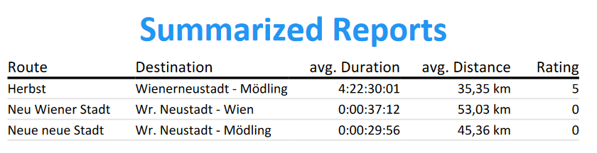

# Tour Planner
https://github.com/jakobfriedl/tour-planner

SWEN2 SS2022 Semesterproject - by Jakob Friedl (if20b089) & Philipp Haider (if20b097)

## Solution Structure and Architecture

```c
├── src 
│   ├── TourPlanner
│   │   ├── Config 
│   │   │   ├── settings.json // custom configuration, copied to output directory 
│   │   ├── Utility // helper classes
│   │   ├── ViewModels
│   │   │   ├── Abstract // abstract base classes
│   │   │   ├── Commands 
│   │   │   │   ├── [*]Command.cs
│   │   │   ├── [*]ViewModel.cs
│   │   ├── Views // UserControls and dialog windows
│   │   │   ├── [*].xaml
│   ├── TourPlanner.BusinessLayer 
│   │   ├── Abstract // interfaces
│   │   │   ├── I[*]Manager.cs 
│   │   ├── Exceptions // custom exceptions 
│   │   ├── [*]Manager.cs 
│   │   ├── [*]ReportGeneration.cs
│   ├── TourPlanner.DataAccessLayer
│   │   ├── Common // interfaces for database and http-request
│   │   ├── Configuration // custom config management
│   │   ├── DAO // interfaces for DAO
│   │   │   ├── I[*]DAO.cs
│   ├── TourPlanner.DataAccessLayer.REST 
│   │   ├── HttpRequest.cs // calls to MapQuest API
│   ├── TourPlanner.DataAccessLayer.SQL
│   │   ├── Database.cs
│   │   ├── [*]DAO.cs
│   ├── TourPlanner.Models
├── tests
│   ├── TourPlanner.Tests // Unit Tests for Presentation Layer classes
│   ├── TourPlannerBL.Tests // Unit Tests for Business Layer classes
```

This C#-WPF application was developed with regard to the MVVM (Model-View-ViewModel) Design Pattern. All logic of View components is defined in the corresponding ViewModel. The communication between ViewModels is ensured via dependency injection in the App.xaml.cs file in the presentation layer. Events are handelt with Commands and DataBindings. The project is divided into several layers, where each layer is separated by the definition of the single responsibility principle.  

### Design Patterns
- MVVM
- Command Pattern
- Factory Pattern
- Observer Pattern 
- Dependency Injection
- ...

## Features 
- Create Tours (Metrics automatically queried from API or calculated)
- Image of route queried from API and saved on file system
- Delete/Modify Tours
- Create Logs for a specific Tour 
- Delete/Modify Logs
- Full Text Search for Tours based on Name, Description, Start, Destination and Comment in TourLogs
- Generate TourReport for single tour with all information + logs
- Generate SummarizeReport for complete tour-list with statistical overview
- Import and Export Tours with Logs in Json-Format
- Custom configuration file allowing the user to change image-path, database-access, etc. 
- Validated User-Input 

## Unique Feature 
The unique feature of the TourPlanner Project is a button that instantly swaps the start and destination of the selected tour. Furthermore, all logs now contain information about the start and destination. Thus, logs in both directions are stored in the database and shown for the selected tour. This unique feature was chosen because, from own experience, such an feature is highly useful and requested. 

## Development Process and Design

### Frontend
The frontend of the application consists of multiple UserControls that design the look of a specific component (e.g the search-bar or log-list). The window can be resized and is fully responsive. If the tour or log list gets too long, the app automatically provides a vertical scrollbar. When creating/editing a tour or log, the user is prompted with an modal dialog. In order to avoid duplicate code, Create and Edit use the same UserControl. Edit furthermore fills the fields with the already existing data from the selected tour or log. 


### Models 

The models are placed in a separate layer so that all other layers have access to them and to avoid code duplication. There are two kinds of Data-Models used in the project, the Tour-Model and the Log-Model. Both classes contain all necessary properties and multiple constructors for Tour- and Log-objects. 

### Backend 

When a button is pressed, its command executes a function on the ViewModel which sends or requests data from the corresponding Manager in the BusinessLayer. This Log or TourManager then creates a request to SQL- and/or REST-DAL and sends the results back to the ViewModel where the view is then adapted. 


### Unit Tests
In terms of unit-testing, there is one test-project regarding the Business Layer as well as one project for testing code of the Presentation Layer. Since we do not want to manipulate our database storage with unit-tests, the SQL-DAL is usually mocked when it is referenced in the business layer tests. 

When it comes to the Business Layer, the tests cover all Manager-classes and test the HTTP-Request when creating a new tour, or the calculation of the popularity and child-friendliness values, for example. In addition, the test cases check if all Business Layer functions return the correct value to the Presentation Layer.

## Lessons learned 
- Building complex WPF-Apps 
- API integration to C# projects
- Custom configuration files
- Multi-layered architecture and structure
- MVVM-Pattern
- PDF-Generation libraries
- Efficient DAL structure
- Dependency injection 
- Resolving Merge-conflicts 

## Screenshots




## Time Tracking

TODO 

## External Libraries

[Extended WPF Toolkit](https://github.com/xceedsoftware/wpftoolkit) for DateTimePicker, WatermarkTextBox and other advanced WPF elements

[QuestPDF](https://github.com/QuestPDF/QuestPDF) for PDF-Report generation 
